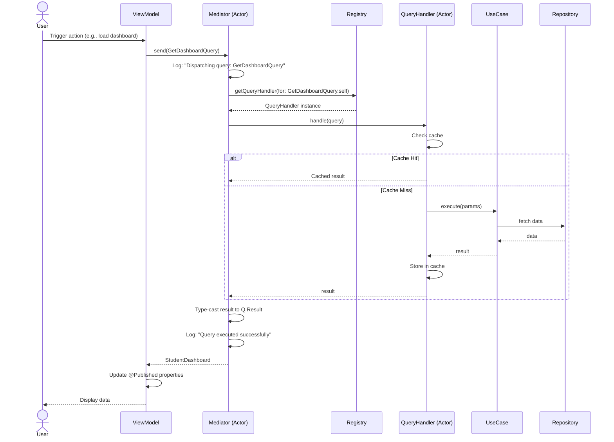
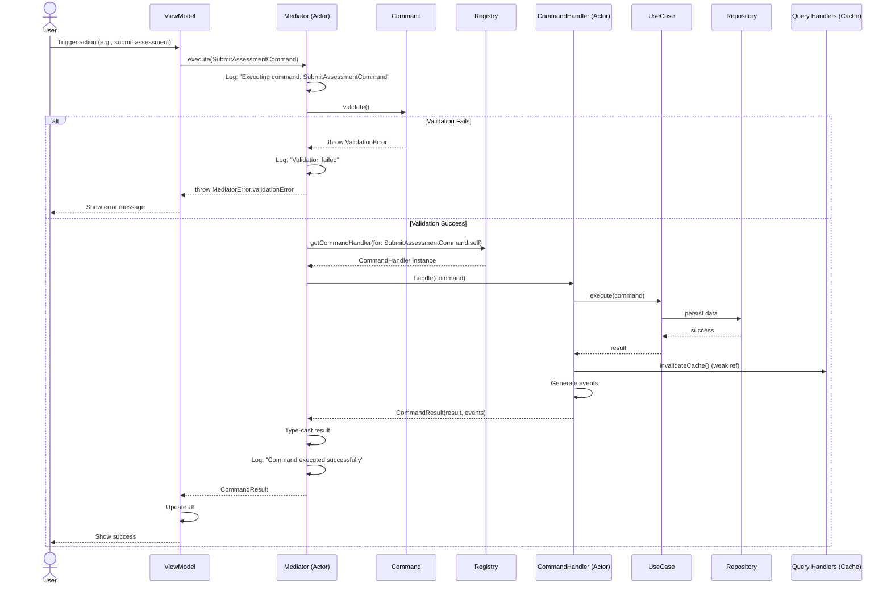
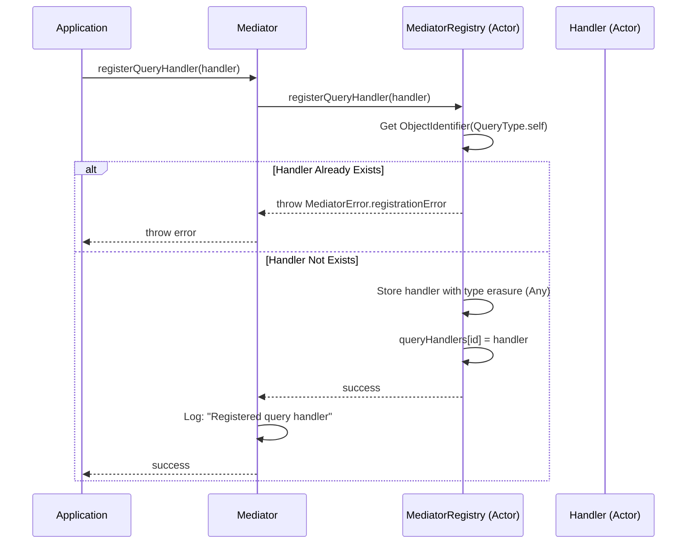
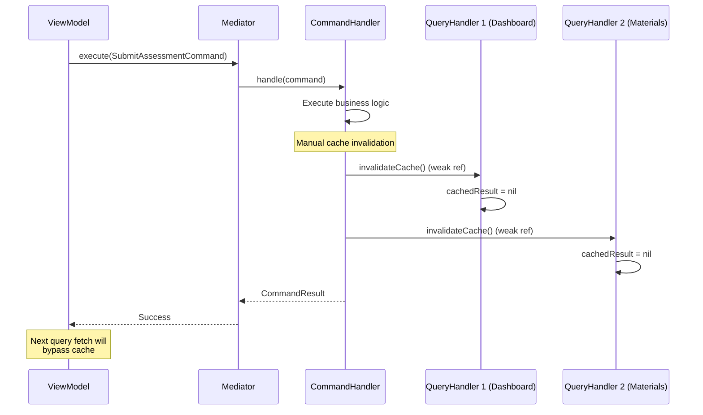
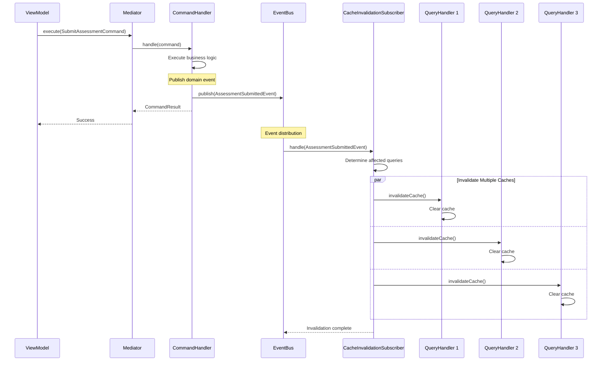
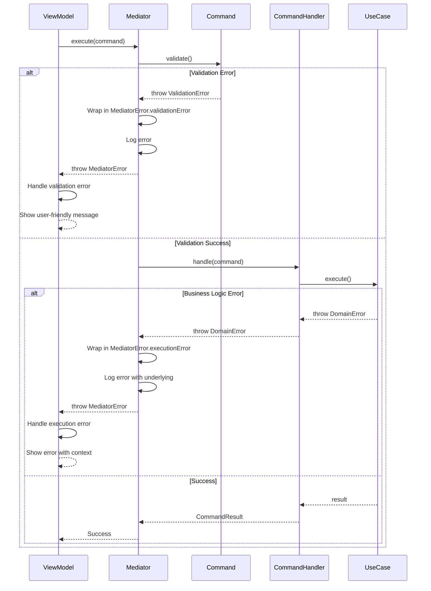
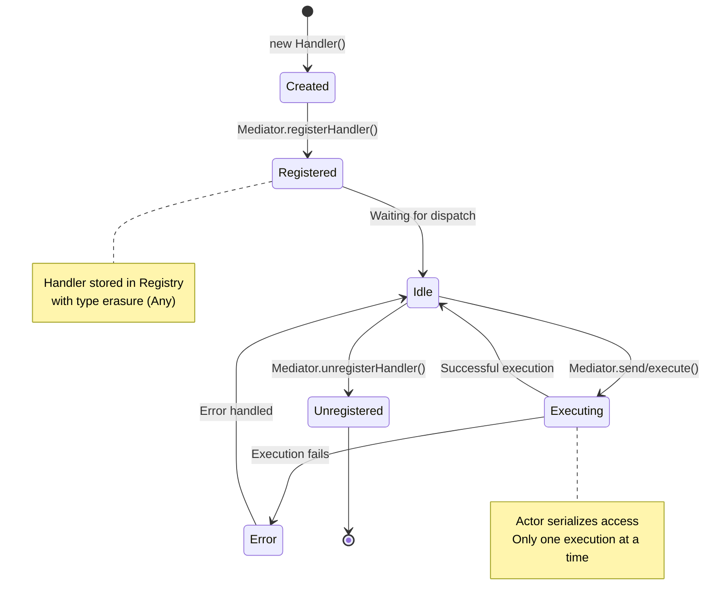
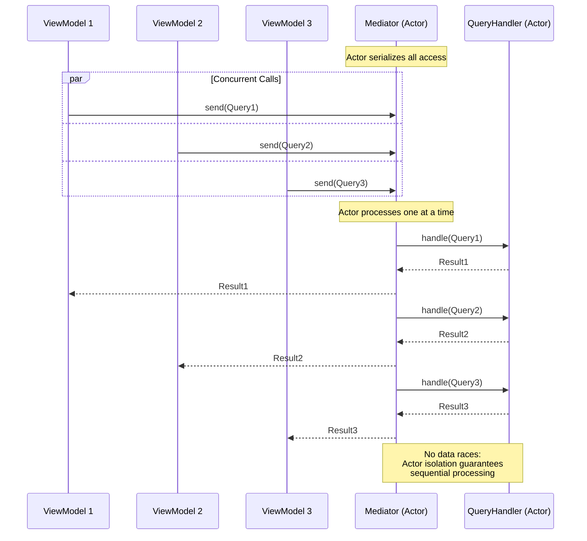

# CQRS Flow Diagrams

Diagramas de flujo de los principales procesos en el módulo CQRS.

## Tabla de Contenidos

1. [Query Flow](#query-flow)
2. [Command Flow](#command-flow)
3. [Handler Registration Flow](#handler-registration-flow)
4. [Cache Invalidation Flow (Actual)](#cache-invalidation-flow-actual)
5. [Cache Invalidation Flow (Futuro con EventBus)](#cache-invalidation-flow-futuro-con-eventbus)
6. [Error Handling Flow](#error-handling-flow)

---

## Query Flow

Flujo completo de una Query desde el ViewModel hasta el Repository.



**Puntos Clave**:
1. Mediator serializa el dispatch (actor isolation)
2. QueryHandler puede usar cache internamente
3. Type safety garantizada por Swift generics
4. Logging estructurado en cada paso

---

## Command Flow

Flujo completo de un Command con validación y generación de eventos.



**Puntos Clave**:
1. Validación pre-ejecución obligatoria
2. CommandHandler genera eventos
3. Cache invalidation manual (temporal)
4. CommandResult encapsula resultado + eventos

---

## Handler Registration Flow

Flujo de registro de handlers en el Mediator.



**Type Erasure**:
```swift
// Registry almacena handlers heterogéneos
var queryHandlers: [ObjectIdentifier: Any] = [:]

// Registro con type erasure
let key = ObjectIdentifier(H.QueryType.self)
queryHandlers[key] = handler  // Any

// Recuperación con runtime cast
let handler = queryHandlers[key] as! any QueryHandler
```

---

## Cache Invalidation Flow (Actual)

Estrategia actual usando weak references entre handlers.



**Limitaciones**:
- ❌ Tight coupling: CommandHandler conoce QueryHandlers específicos
- ❌ No escala: N commands × M queries
- ❌ Weak references pueden ser nil inesperadamente
- ❌ Difícil de testear

---

## Cache Invalidation Flow (Futuro con EventBus)

Estrategia futura usando Domain Events para desacoplar.



**Beneficios**:
- ✅ Desacoplamiento total: CommandHandler no conoce QueryHandlers
- ✅ Escala: agregar queries no requiere modificar commands
- ✅ Extensible: agregar subscribers sin cambiar código existente
- ✅ Testeable: mock del EventBus es trivial

**Implementación en Sprint 4**:
```swift
// Domain Event
struct AssessmentSubmittedEvent: DomainEvent {
    let assessmentId: String
    let studentId: String
    let timestamp: Date
}

// CommandHandler publica evento
actor SubmitAssessmentHandler: CommandHandler {
    let eventBus: EventBus
    
    func handle(_ command: SubmitAssessmentCommand) async throws -> CommandResult {
        let result = try await useCase.execute(command)
        
        // Publicar evento - desacoplado
        await eventBus.publish(AssessmentSubmittedEvent(
            assessmentId: command.assessmentId,
            studentId: command.studentId,
            timestamp: Date()
        ))
        
        return CommandResult(result: result, events: ["AssessmentSubmitted"])
    }
}

// Subscriber maneja invalidación
actor CacheInvalidationSubscriber: EventSubscriber {
    let mediator: Mediator
    
    func handle(_ event: AssessmentSubmittedEvent) async {
        // Estrategia: invalidar queries que dependan de assessments del student
        await invalidateDashboard(studentId: event.studentId)
        await invalidateAssessmentsList(studentId: event.studentId)
    }
}
```

---

## Error Handling Flow

Flujo de propagación y manejo de errores en el sistema.



**Error Hierarchy**:
```
MediatorError (top-level)
├── handlerNotFound
│   └── Cuando no hay handler registrado
├── registrationError
│   └── Cuando falla registro de handler
├── validationError
│   └── Cuando Command.validate() falla
│       └── underlyingError: ValidationError (del dominio)
└── executionError
    └── Cuando Handler.handle() falla
        └── underlyingError: DomainError (del caso de uso)
```

---

## Handler Lifecycle

Diagrama de estados de un handler durante su ciclo de vida.



---

## Concurrent Dispatch Flow

Cómo el Mediator maneja múltiples dispatches concurrentes.



**Garantías de Concurrencia**:
1. Mediator (actor) serializa dispatches
2. QueryHandler (actor) serializa ejecuciones
3. No data races por diseño (Swift 6 strict concurrency)
4. Sendable checked en compile-time

---

## Performance Considerations

### Query con Cache Hit

```
ViewModel → Mediator → QueryHandler (cache hit)
   ↓           ↓              ↓
  1ms        2ms           0.1ms (memoria)
                          ↓
                       Total: ~3ms
```

### Query con Cache Miss

```
ViewModel → Mediator → QueryHandler → UseCase → Repository → Network
   ↓           ↓            ↓           ↓           ↓           ↓
  1ms        2ms         0.5ms       5ms        50ms       200ms
                                                              ↓
                                                         Total: ~258ms
```

### Command con Cache Invalidation

```
ViewModel → Mediator → CommandHandler → UseCase → Repository
   ↓           ↓            ↓              ↓           ↓
  1ms        2ms         0.5ms          5ms        100ms
                            ↓
                    invalidateCache() × 3 handlers
                            ↓
                          3ms
                            ↓
                       Total: ~111ms
```

---

**Última actualización**: 2026-01-30  
**Versión**: 1.0.0
