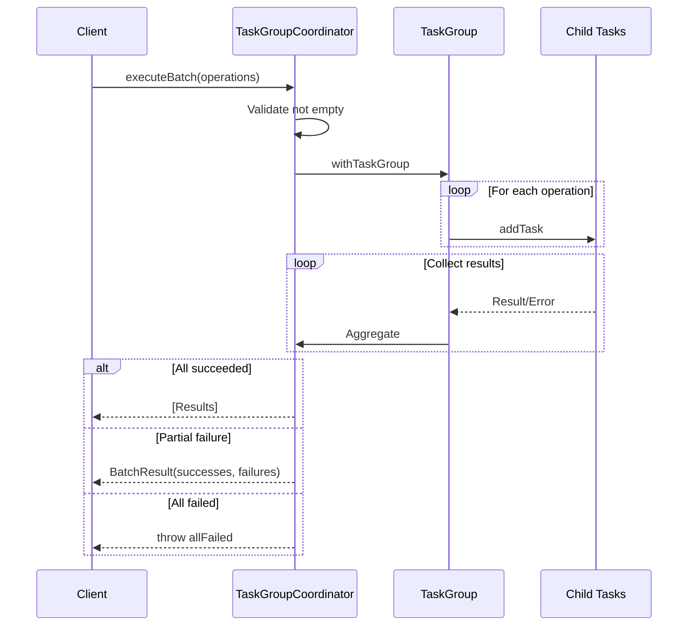

# Concurrency Architecture

> Arquitectura de concurrencia para operaciones batch en LocalPersistence usando Swift Concurrency y Task Groups.

## Overview

El módulo LocalPersistence implementa una arquitectura de concurrencia robusta basada en **Swift Structured Concurrency** y **Task Groups** para manejar operaciones batch de forma eficiente y segura.

### Principios de Diseño

1. **Actor Isolation**: Todos los repositorios son actores que garantizan acceso thread-safe
2. **Structured Concurrency**: Uso de task groups para operaciones paralelas con lifetime management
3. **Error Aggregation**: Recolección de errores parciales sin perder resultados exitosos
4. **Cooperative Cancellation**: Propagación de cancelación a todas las child tasks
5. **Configurable Timeouts**: Timeouts sin race conditions usando structured concurrency

## Componentes Principales

```
┌─────────────────────────────────────────────────────────────────┐
│                    LocalPersistence Module                       │
├─────────────────────────────────────────────────────────────────┤
│  ┌─────────────────┐  ┌─────────────────┐  ┌─────────────────┐  │
│  │ LocalUserRepo   │  │ LocalDocRepo    │  │ LocalSchoolRepo │  │
│  │    (actor)      │  │    (actor)      │  │    (actor)      │  │
│  └────────┬────────┘  └────────┬────────┘  └────────┬────────┘  │
│           │                    │                    │           │
│           └────────────────────┼────────────────────┘           │
│                                │                                │
│  ┌─────────────────────────────▼─────────────────────────────┐  │
│  │              TaskGroupCoordinator<T>                       │  │
│  │  ┌─────────────┐ ┌─────────────┐ ┌─────────────────────┐  │  │
│  │  │ executeBatch│ │ Collecting  │ │ executeWithRetry    │  │  │
│  │  └─────────────┘ └─────────────┘ └─────────────────────┘  │  │
│  └─────────────────────────────┬─────────────────────────────┘  │
│                                │                                │
│  ┌─────────────────────────────▼─────────────────────────────┐  │
│  │              CancellationHandler                           │  │
│  │  ┌─────────────┐ ┌─────────────┐ ┌─────────────────────┐  │  │
│  │  │ withTimeout │ │ cleanup     │ │ checkCancellation   │  │  │
│  │  └─────────────┘ └─────────────┘ └─────────────────────┘  │  │
│  └───────────────────────────────────────────────────────────┘  │
└─────────────────────────────────────────────────────────────────┘
```

## Flujo de Operaciones Batch



## Arquitectura de Tipos

### TaskGroupCoordinator

El coordinador central para operaciones batch:

```swift
public actor TaskGroupCoordinator<T: Sendable> {
    // Configuración
    public private(set) var defaultOptions: TaskBatchOptions
    
    // Métricas
    public private(set) var totalOperationsExecuted: Int
    public private(set) var totalSuccesses: Int
    public private(set) var totalFailures: Int
    
    // Operaciones principales
    func executeBatch(_ operations: [...]) async throws -> [T]
    func executeBatchCollecting(_ operations: [...]) async -> BatchResult<T>
    func executeWithRetry(maxAttempts:strategy:operation:) async throws -> T
}
```

### Jerarquía de Errores

```
TaskGroupError
├── partialFailure(successCount, errors)
├── cancelled
├── timeout(duration)
├── allFailed(errors)
├── emptyBatch
└── maxRetriesExceeded(attempts, lastError)

CancellationReason
├── timeout(duration)
├── userCancelled
├── systemCancelled(reason)
├── parentTaskCancelled
├── batchCancelled(completed, total)
└── resourceUnavailable(resource)
```

### Configuración

```swift
// Opciones de batch
TaskBatchOptions(
    configuration: TaskGroupConfiguration,
    retryStrategy: TaskRetryStrategy,
    throwOnAnyFailure: Bool
)

// Configuración de task group
TaskGroupConfiguration(
    timeout: Duration?,
    cancelOnFirstError: Bool,
    maxConcurrency: Int?
)

// Estrategias de retry
TaskRetryStrategy.none
TaskRetryStrategy.fixed(delay:maxAttempts:)
TaskRetryStrategy.exponential(baseDelay:maxDelay:maxAttempts:)
```

## Patrones de Uso

### 1. Batch Simple (Todo o Nada)

```swift
let coordinator = TaskGroupCoordinator<User>()
let operations = userIDs.map { id in
    { try await repository.get(id: id) }
}

// Lanza si alguna operación falla
let users = try await coordinator.executeBatch(operations)
```

### 2. Batch con Resultados Parciales

```swift
let result = await coordinator.executeBatchCollecting(operations)

if result.hasPartialSuccess {
    print("Exitosos: \(result.successes.count)")
    print("Fallidos: \(result.failures.count)")
    
    // Procesar errores
    for failure in result.failures {
        log.error("Op \(failure.index) falló: \(failure.error)")
    }
}
```

### 3. Con Rate Limiting

```swift
// Máximo 10 operaciones concurrentes
let results = try await coordinator.executeBatch(
    operations,
    maxConcurrency: 10
)
```

### 4. Con Timeout

```swift
let options = TaskBatchOptions(
    configuration: TaskGroupConfiguration(timeout: .seconds(30))
)

let results = try await coordinator.executeBatch(
    operations,
    options: options
)
```

### 5. Con Reintentos

```swift
let result = try await coordinator.executeWithRetry(
    maxAttempts: 3,
    strategy: .exponential(
        baseDelay: .seconds(1),
        maxDelay: .seconds(30),
        maxAttempts: 3
    )
) {
    try await riskyNetworkOperation()
}
```

## Thread Safety

### Actor Isolation

Todos los repositorios son actores:

```swift
public actor LocalUserRepository {
    private let containerProvider: PersistenceContainerProvider
    
    public func save(_ user: User) async throws {
        // Acceso serializado automáticamente
    }
}
```

### Sendable Closures

Las operaciones deben ser `@Sendable`:

```swift
let operations: [@Sendable () async throws -> T] = items.map { item in
    { try await process(item) }
}
```

## Métricas y Observabilidad

### Métricas del Coordinador

```swift
let metrics = await coordinator.metrics
print("Total: \(metrics.totalOperations)")
print("Éxitos: \(metrics.successes)")
print("Fallos: \(metrics.failures)")
print("Tasa de éxito: \(metrics.successRate)")
```

### BatchResult Metrics

```swift
let result = await coordinator.executeBatchCollecting(operations)
print("Duración: \(result.duration)")
print("Tasa de éxito: \(result.successRate)")
print("¿Éxito parcial?: \(result.hasPartialSuccess)")
```

## Decisiones de Diseño

### Por qué Task Groups sobre async let

| Aspecto | Task Groups | async let |
|---------|-------------|-----------|
| Número de operaciones | Dinámico | Fijo en compile time |
| Error handling | Agregación flexible | Primer error gana |
| Cancellation | Control granular | Todo o nada |
| Memory | Eficiente con muchas ops | Mejor para pocas ops |

### Por qué Actors sobre Locks

- **Compile-time safety**: El compilador garantiza aislamiento
- **No deadlocks**: Actors no pueden bloquearse mutuamente
- **Reentrant-safe**: Las llamadas reentrantes son seguras
- **Integration**: Mejor integración con async/await

### Por qué Structured Concurrency

- **Lifetime management**: Las child tasks no sobreviven a la parent
- **Automatic cancellation**: Cancelación se propaga automáticamente
- **Resource cleanup**: defer funciona correctamente
- **Error propagation**: Errores se propagan correctamente

## Performance Considerations

### Batch Size Recommendations

| Operación | Tamaño Recomendado | Max Concurrency |
|-----------|-------------------|-----------------|
| Network I/O | 10-50 | 5-10 |
| Disk I/O | 50-100 | 10-20 |
| CPU-bound | 100-500 | ProcessorCount |
| Memory-intensive | 10-20 | 5 |

### Memory Usage

- Use `reserveCapacity` para arrays de resultados
- Considere streaming para datasets muy grandes
- Monitoree memory pressure en operaciones largas

## Testing

Ver [Testing Guide](./TaskGroupPatterns.md#testing) para patrones de testing de código concurrente.

## Related Documentation

- [Task Group Patterns](./TaskGroupPatterns.md)
- [Error Handling Guide](./ErrorHandlingGuide.md)
- [Migration Guide](./MigrationGuide.md)
- [Batch Operation Flow Diagram](./Diagrams/BatchOperationFlow.mmd)
