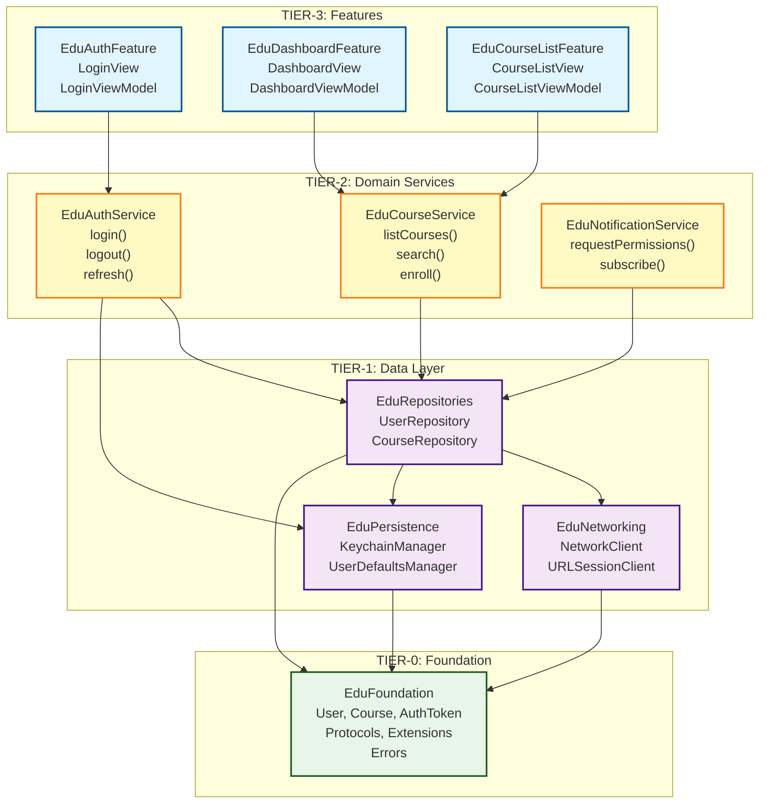

# Diagrama de Arquitectura de Tiers

**Visualización detallada de la arquitectura de 4 capas**

---

## 📊 Vista General (ASCII)

```
┌─────────────────────────────────────────────────────────────────────────┐
│                         TIER-3: Feature Modules                          │
│                      (UI + ViewModels + Navigation)                      │
│                                                                           │
│  ┌─────────────────┐  ┌─────────────────┐  ┌─────────────────┐          │
│  │  EduAuthFeature │  │ EduDashboard    │  │ EduCourseList   │          │
│  │                 │  │ Feature         │  │ Feature         │          │
│  │  - LoginView    │  │ - DashboardView │  │ - CourseListView│          │
│  │  - LoginVM      │  │ - DashboardVM   │  │ - CourseListVM  │          │
│  └────────┬────────┘  └────────┬────────┘  └────────┬────────┘          │
│           │                    │                     │                   │
│           │                    │                     │                   │
│           └────────────────────┴─────────────────────┘                   │
│                                 ↓                                        │
└─────────────────────────────────────────────────────────────────────────┘

┌─────────────────────────────────────────────────────────────────────────┐
│                      TIER-2: Domain Services                             │
│                   (Orquestación + Lógica de Negocio)                     │
│                                                                           │
│  ┌─────────────────┐  ┌─────────────────┐  ┌─────────────────┐          │
│  │ EduAuthService  │  │ EduCourseService│  │ EduNotification │          │
│  │                 │  │                 │  │ Service         │          │
│  │ - login()       │  │ - listCourses() │  │ - request       │          │
│  │ - logout()      │  │ - search()      │  │   Permissions() │          │
│  │ - refresh()     │  │ - enroll()      │  │ - subscribe()   │          │
│  └────────┬────────┘  └────────┬────────┘  └────────┬────────┘          │
│           │                    │                     │                   │
│           │                    │                     │                   │
│           └────────────────────┴─────────────────────┘                   │
│                                 ↓                                        │
└─────────────────────────────────────────────────────────────────────────┘

┌─────────────────────────────────────────────────────────────────────────┐
│                         TIER-1: Data Layer                               │
│              (Repositorios + Clientes + Persistencia)                    │
│                                                                           │
│  ┌─────────────────┐  ┌─────────────────┐  ┌─────────────────┐          │
│  │ EduNetworking   │  │ EduPersistence  │  │ EduRepositories │          │
│  │                 │  │                 │  │                 │          │
│  │ - NetworkClient │  │ - Keychain      │  │ - UserRepo      │          │
│  │ - URLSession    │  │   Manager       │  │ - CourseRepo    │          │
│  │   Client        │  │ - UserDefaults  │  │ - DTOs/Mappers  │          │
│  └────────┬────────┘  └────────┬────────┘  └────────┬────────┘          │
│           │                    │                     │                   │
│           │                    │                     │                   │
│           └────────────────────┴─────────────────────┘                   │
│                                 ↓                                        │
└─────────────────────────────────────────────────────────────────────────┘

┌─────────────────────────────────────────────────────────────────────────┐
│                      TIER-0: Foundation                                  │
│               (Modelos + Protocolos + Extensiones)                       │
│                                                                           │
│  ┌─────────────────────────────────────────────────────────┐             │
│  │              EduFoundation                              │             │
│  │                                                         │             │
│  │  Models:                                                │             │
│  │   - User, AuthToken, Course, Enrollment                │             │
│  │                                                         │             │
│  │  Protocols:                                             │             │
│  │   - UserRepository, CourseRepository                   │             │
│  │                                                         │             │
│  │  Extensions:                                            │             │
│  │   - String+Validation, Date+Format                     │             │
│  │                                                         │             │
│  │  Errors:                                                │             │
│  │   - AuthError, NetworkError                            │             │
│  └─────────────────────────────────────────────────────────┘             │
│                                                                           │
│                    🔒 SIN DEPENDENCIAS INTERNAS                          │
└─────────────────────────────────────────────────────────────────────────┘
```

---

## 🔗 Reglas de Dependencias (Detalladas)

### Matriz de Dependencias

| Desde ↓ / Hacia → | TIER-0 | TIER-1 | TIER-2 | TIER-3 |
|------------------|--------|--------|--------|--------|
| **TIER-0**       | ❌     | ❌     | ❌     | ❌     |
| **TIER-1**       | ✅     | ❌     | ❌     | ❌     |
| **TIER-2**       | ✅     | ✅     | ❌     | ❌     |
| **TIER-3**       | ✅     | ✅     | ✅     | ❌     |

**Leyenda**:
- ✅ = Dependencia permitida
- ❌ = Dependencia prohibida

### Flujo de Datos (Request)

```
Usuario toca botón "Login"
         ↓
┌────────────────────────────────────┐
│ TIER-3: LoginView                  │
│  ↓ Llama a                         │
│ LoginViewModel.login()             │
└────────────────────────────────────┘
         ↓
┌────────────────────────────────────┐
│ TIER-2: AuthService.login()        │
│  ↓ Orquesta                        │
│  1. UserRepository.login()         │
│  2. KeychainManager.save(token)    │
│  3. Logger.log()                   │
└────────────────────────────────────┘
         ↓
┌────────────────────────────────────┐
│ TIER-1: DefaultUserRepository      │
│  ↓ Usa                             │
│  1. NetworkClient.request()        │
│  2. UserMapper.toDomain()          │
└────────────────────────────────────┘
         ↓
┌────────────────────────────────────┐
│ TIER-0: User (modelo)              │
│  ← Retorna                         │
└────────────────────────────────────┘
```

### Flujo de Datos (Response)

```
┌────────────────────────────────────┐
│ TIER-1: NetworkClient recibe JSON  │
│  ↓ Decodifica                      │
│ UserDTO (JSON → Struct)            │
└────────────────────────────────────┘
         ↓
┌────────────────────────────────────┐
│ TIER-1: UserMapper                 │
│  ↓ Convierte                       │
│ UserDTO → User (domain model)      │
└────────────────────────────────────┘
         ↓
┌────────────────────────────────────┐
│ TIER-2: AuthService                │
│  ↓ Actualiza                       │
│ currentUser: User?                 │
└────────────────────────────────────┘
         ↓
┌────────────────────────────────────┐
│ TIER-3: LoginViewModel             │
│  ↓ Publica                         │
│ @Published state = .success(user)  │
└────────────────────────────────────┘
         ↓
Usuario ve pantalla de dashboard
```

---

## 📦 Diagrama Mermaid (Para README de GitHub)



---

## 🔍 Ejemplo Detallado de Dependencias

### Caso: Feature de Login

```
┌─────────────────────────────────────────────────────────────┐
│ Sources/TIER-3/EduAuthFeature/                              │
│                                                              │
│ Public/                                                      │
│  ├── LoginView.swift                                        │
│  │   import SwiftUI                                         │
│  │   import EduAuthService  ← TIER-2                        │
│  │                                                           │
│  └── LoginViewModel.swift                                   │
│      import Foundation                                      │
│      import EduAuthService  ← TIER-2                        │
│      import EduFoundation   ← TIER-0 (para User, AuthError) │
└─────────────────────────────────────────────────────────────┘
                           ↓
┌─────────────────────────────────────────────────────────────┐
│ Sources/TIER-2/EduAuthService/                              │
│                                                              │
│ Public/                                                      │
│  └── AuthService.swift                                      │
│      import Foundation                                      │
│      import EduFoundation   ← TIER-0 (protocolos, modelos)  │
│      import EduRepositories ← TIER-1 (UserRepository)       │
│      import EduPersistence  ← TIER-1 (KeychainManager)      │
│      import os  (sistema)                                   │
└─────────────────────────────────────────────────────────────┘
                           ↓
┌─────────────────────────────────────────────────────────────┐
│ Sources/TIER-1/EduRepositories/                             │
│                                                              │
│ Internal/                                                    │
│  └── DefaultUserRepository.swift                            │
│      import Foundation                                      │
│      import EduFoundation   ← TIER-0 (UserRepository proto) │
│      import EduNetworking   ← TIER-1 (NetworkClient)        │
└─────────────────────────────────────────────────────────────┘
                           ↓
┌─────────────────────────────────────────────────────────────┐
│ Sources/TIER-1/EduNetworking/                               │
│                                                              │
│ Public/                                                      │
│  └── NetworkClient.swift                                    │
│      import Foundation                                      │
│      import EduFoundation   ← TIER-0 (NetworkError)         │
└─────────────────────────────────────────────────────────────┘
                           ↓
┌─────────────────────────────────────────────────────────────┐
│ Sources/TIER-0/EduFoundation/                               │
│                                                              │
│ Public/                                                      │
│  ├── Models/                                                │
│  │   ├── User.swift                                         │
│  │   └── AuthToken.swift                                    │
│  ├── Protocols/                                             │
│  │   └── UserRepository.swift                               │
│  └── Errors/                                                │
│      ├── AuthError.swift                                    │
│      └── NetworkError.swift                                 │
│                                                              │
│  SIN IMPORTS DE MÓDULOS INTERNOS                            │
└─────────────────────────────────────────────────────────────┘
```

---

## ⚠️ Violaciones Comunes (Y Cómo Evitarlas)

### Violación 1: TIER-0 Importa Módulo Interno

```swift
// ❌ MAL: Sources/TIER-0/EduFoundation/Public/Models/User.swift
import EduNetworking  // ❌ TIER-0 no puede importar TIER-1

public struct User: Sendable {
    let networkClient: NetworkClient  // ❌ PROHIBIDO
}
```

**Corrección**:
```swift
// ✅ BIEN: TIER-0 solo define el modelo
import Foundation

public struct User: Sendable {
    public let id: UUID
    public let name: String
    public let email: String
}
```

### Violación 2: TIER-1 Importa TIER-2

```swift
// ❌ MAL: Sources/TIER-1/EduRepositories/Internal/DefaultUserRepository.swift
import EduAuthService  // ❌ TIER-1 no puede importar TIER-2

final class DefaultUserRepository: UserRepository {
    private let authService: AuthService  // ❌ PROHIBIDO
}
```

**Corrección**: Invertir la dependencia.
```swift
// ✅ BIEN: TIER-2 depende de TIER-1, no al revés
// Sources/TIER-2/EduAuthService/Public/AuthService.swift
import EduRepositories

public final class AuthService {
    private let userRepository: UserRepository  // ✅ TIER-2 usa TIER-1
}
```

### Violación 3: Saltar Tiers

```swift
// ❌ MAL: Sources/TIER-3/EduAuthFeature/Public/LoginViewModel.swift
import EduRepositories  // ❌ TIER-3 salta TIER-2

@MainActor
final class LoginViewModel {
    private let userRepository: UserRepository  // ❌ Usar TIER-2 en su lugar
}
```

**Corrección**:
```swift
// ✅ BIEN: TIER-3 usa TIER-2 como intermediario
import EduAuthService

@MainActor
final class LoginViewModel {
    private let authService: AuthService  // ✅ TIER-2 orquesta TIER-1
}
```

---

## 📚 Referencias

- [ARCHITECTURE.md](../ARCHITECTURE.md) - Justificación de decisiones
- [DEVELOPMENT_GUIDE.md](../DEVELOPMENT_GUIDE.md) - Guía práctica
- [Clean Architecture (Uncle Bob)](https://blog.cleancoder.com/uncle-bob/2012/08/13/the-clean-architecture.html)

---

**Versión**: 1.0.0
**Última actualización**: 2026-01-23
**Mantenedor**: @edugo-ios-team
